## 특정 프로젝트만 표시하기

저장소의 **Settings → Secrets and variables → Actions → Variables**에서
`INCLUDE_REPOS`를 추가하고, 표시할 저장소를 `owner/repo` 형식으로 입력합니다.
여러 저장소는 쉼표로 구분할 수 있습니다.

```text
ros2/rclcpp,ros2/rclpy
```

Actions의 **Update Contributions SVG → Run workflow**에서도 같은 값을 일회성으로
입력할 수 있습니다. 값을 비워 두면 기존처럼 모든 외부 저장소의 기여를 표시합니다.
